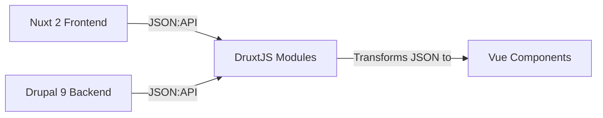

# Architecture Overview

## System Stack



## Frontend (Nuxt 2)

- **Framework**: Nuxt 2.15.8 (Vue 2)
- **Styling**: Tailwind CSS + DaisyUI
- **State Management**: Vuex (via Druxt)
- **API Integration**: DruxtJS modules

### Key Components

| Component | Purpose |
|-----------|---------|
| `druxt-site` | Connects to Drupal and handles routing |
| `druxt-entity` | Renders Drupal entities (nodes, paragraphs) |
| `druxt-layout-paragraphs` | Layout paragraph components |
| `@druxt-contrib/config-pages` | Config pages integration |

### Directory Structure

```
nuxt/
├── components/
│   ├── druxt/           # Druxt entity components
│   │   ├── entity/      # Node/paragraph templates
│   │   ├── field/       # Field components
│   │   └── layout-paragraph/  # Layout components
│   ├── dui/             # Design system components
│   └── logo/            # Logo components
├── pages/
│   ├── index.vue        # Homepage
│   └── articles/        # Article listing/detail
├── plugins/             # Nuxt plugins (gtag)
├── layouts/             # Layout templates
└── feeds/               # RSS feed generation
```

## Backend (Drupal 9)

- **Core**: Drupal 9.4.x
- **API**: JSON:API module (core)
- **Caching**: Memcache
- **Static Generation**: Tome (Drupal static site generator)

### Key Modules

- `druxt` - Provides JSON:API endpoints
- `jsonapi_node_preview` - Node preview functionality
- `layout_paragraphs` - Layout builder for paragraphs
- `simple_sitemap` - XML sitemap generation

## Data Flow

1. **Page Request**: User requests a page from Nuxt
2. **Drupal Query**: Nuxt queries Drupal JSON:API
3. **Entity Render**: Druxt modules transform JSON to Vue components
4. **HTML Output**: Nuxt generates static HTML

## Environment Variables

- `BASE_URL` - Drupal site URL (default: `http://stuartclark.ddev.site`)
